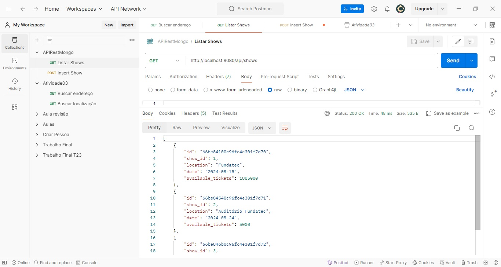
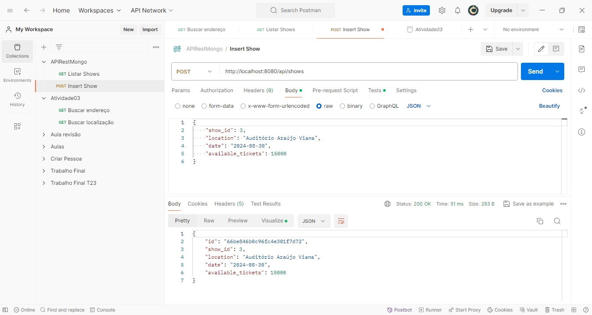

# Instruções de Execução

## Shows API

Este projeto fornece uma API para gerenciar dados de shows utilizando Spring Boot e MongoDB.

## Executando a Aplicação

### 1. Clonar o Repositório

Clone o repositório para o seu ambiente local usando o comando:

```bash
git clone https://github.com/arturbazza/APIRestMongo.git
```

### 2. Navegar para o Diretório do Projeto

Acesse o diretório do projeto clonado:

```bash
cd APIRestMongo
```

### 3. Executar a Aplicação

Existem duas maneiras de executar a aplicação:

- **a) Usando o IDE**: Abra o arquivo `ApirestmongoApplication.java` em sua IDE (por exemplo, IntelliJ IDEA ou Eclipse) e clique em "Run" (ou "PLAY") para iniciar a aplicação.

- **b) Usando a Linha de Comando**: Execute o seguinte comando para iniciar a aplicação:

    ```bash
    ./mvnw spring-boot:run
    ```

  ou, se estiver usando Gradle:

    ```bash
    ./gradlew bootRun
    ```

### 4. Testar a API com o Postman

Após iniciar a aplicação, você pode testar a API usando o Postman.

#### a) Inserir um Novo Show (POST)

- **URL**: `http://localhost:8080/api/shows`
- **Método**: `POST`
- **Configuração do Body**: Selecione a opção `raw` e defina o tipo como `JSON`. Adicione o seguinte corpo à requisição:

    ```json
    {
        "show_id": 1,
        "location": "Auditório Fundatec",
        "date": "2024-08-24",
        "available_tickets": 100
    }
    ```

#### b) Listar Todos os Shows (GET)

- **URL**: `http://localhost:8080/api/shows`
- **Método**: `GET`

Não é necessário enviar um corpo para esta requisição. Você deve ver uma lista de todos os shows inseridos no banco de dados.

---

#### Extra:
   - Print Screem
        - GET
        
   
        - POST
        

Se tiver alguma dúvida ou encontrar problemas, sinta-se à vontade para entrar em contato arturbc@gmail.com.

Obrigado, professora! <3

@rtur.
